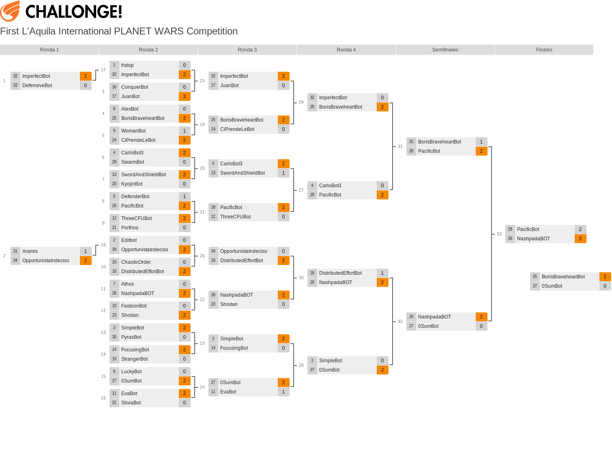

# PlanetWars-0Sum
  
0Sum: a PlanetWars bot for the Google AI challenge.  
Author: Aly Shmahell, 3rd year student, Department of Computer Science, University of L'Aquila  
Course: Computational Intelligence in Videogames and Virtual Reality.  
Supervisor: [Prof. Antonio Mora Garcia](https://github.com/amorag)  
0SumBot ranked 4th place on the [First L'Aquila International PLANET WARS Competition](http://challonge.com/es/1m1t694g)  

